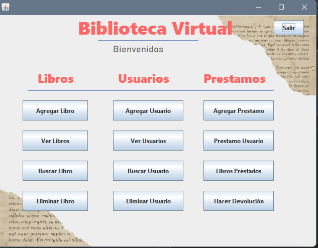
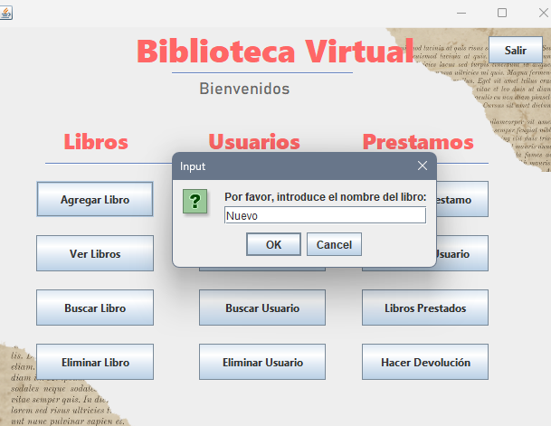
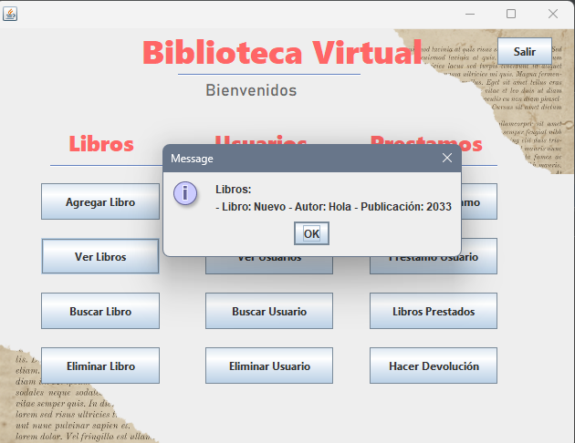
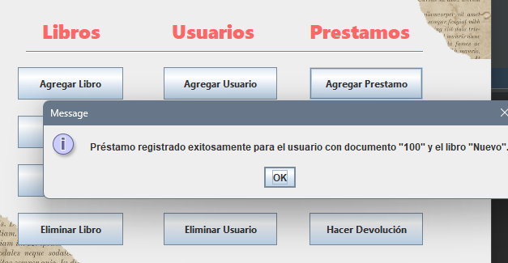

<h1 align="center"><b>🖥️ GUI con Java Gestion de biblioteca </b></h1>
<h3>🌼 Trabajo para la universidad, donde se trabajaron estructuras de datos para la gestión de una biblioteca</h3> 

 

 

Construido con 🛠️

_Herramientas Utilizadas_

- [Java 17.0.13](https://www.java.com/es/) - Lenguaje Princiapl

## Pasos para el uso

**1. Clonar repositorio**

**2. Asegurarse de tener instalado localmente java **

**4. Ingrese algun ditor de codigo como NetBeans pára ejecutar el programa**

## Autores ✒️

- **Karen Vargas** - _Trabajo Inicial_ - [KarenVargas](https://github.com/Karen11Vargas)

